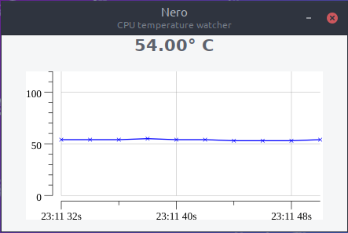

# nero

A CPU temperature watcher based on Go bindings for GTK3+ [gotk3](https://github.com/gotk3/gotk3), [gonum/plot](https://github.com/gonum/plot) and [lm_sensors](https://github.com/lm-sensors/lm-sensors)

## Screenshot


## Requirements
### To build
* [file2byteslice](https://github.com/hajimehoshi/file2byteslice)
* [gotk3](https://github.com/gotk3/gotk3) dependencies

### To run
* [lm_sensors](https://github.com/lm-sensors/lm-sensors)

## Building

```bash
go get -d -u github.com/joaowiciuk/nero
cd ~/$GOPATH/src/github.com/joaowiciuk/nero
go generate
go install
```